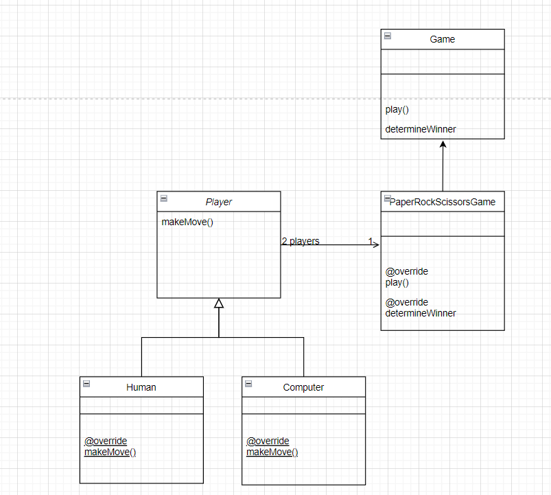

# Paper Rock Scissors
---
> Description : Paper rock scissors is a hand game usually played between two people, in which each player simultaneously forms one of three shapes with an outstretched hand to display -
> • Fist equals rock
> • Open hand equals paper
> • Showing the index and middle finger equals scissors.
> This is a Java Program which aims at automating one of the player as Computerized Player and the taking rock, paper or scissor as an input from the used.
---

## Game Play

The real player types in the number of times (Ex: 3) in the console, they would like to play followed by their move of choice. The computerized player will choose some random choice  [Rock! Paper! or Scissors! ]

## Rules
The winner is determined by the following rules:
• Paper beats (wraps) rock
• Rock beats (blunts) scissors
• Scissors beats (cuts) paper.
If both players choose the same move, the game is tied.

## Algorithm

1. The program will ask to input the number of times you want to play. 
2. User Input will be taken either - "rock", "paper" or "scissor". [Case Insensitive]
3. The computer will choose a random choice between "Rock", "Paper" and "Scissor".
   Logic -
   = We will generate a random number between 1 - 3; if the number is in between
   = 1  --> Computer will choose Paper
   = 2  --> Computer will choose Rock
   = 3  --> Computer will choose Scissor 
4. Input will be compared with computers choice. 
5. According to rules, one of them will win or draw.

## Dependencies

* Java Language

## Requirements

* 64 Bit Windows / Open Source Linux & its derivatives.
* Open Source JDK & IDE like Intellij or Eclipse.